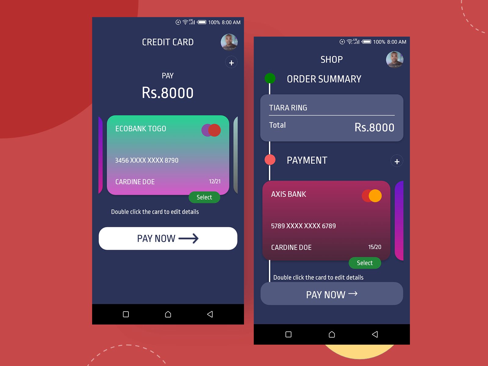

# Credit Card Checkout - A Xamarin.Forms UI Challenge 

This UI Challenge is based on the fantastic dribble designs by [Antra Sharma](https://dribbble.com/antra03).

## Dribble Design

## Screenshot

## Blog Post

I have written a [blog post on the implementation](https://lioncoding.com/2019/10/11/2019-10-11-xamarin-ui-challenge-credit-card-checkout/) of the design over at [my blog](https://lioncoding.com).

# Contributions

All the designs I implement are intended to be for learning more about techniques to create beautiful Xamarin.Forms interfaces.

if you have designs you think might be interesting to implement feel free to shoot them through to me on twitter [@lioncoding](https://twitter.com/lioncoding).

I welcome pull requests and suggestions to improve the solution. Please just raise an issue or submit a pull request.

Feel free to take this code and do what you will, but please make sure you acknowledge myself and also the original designer.